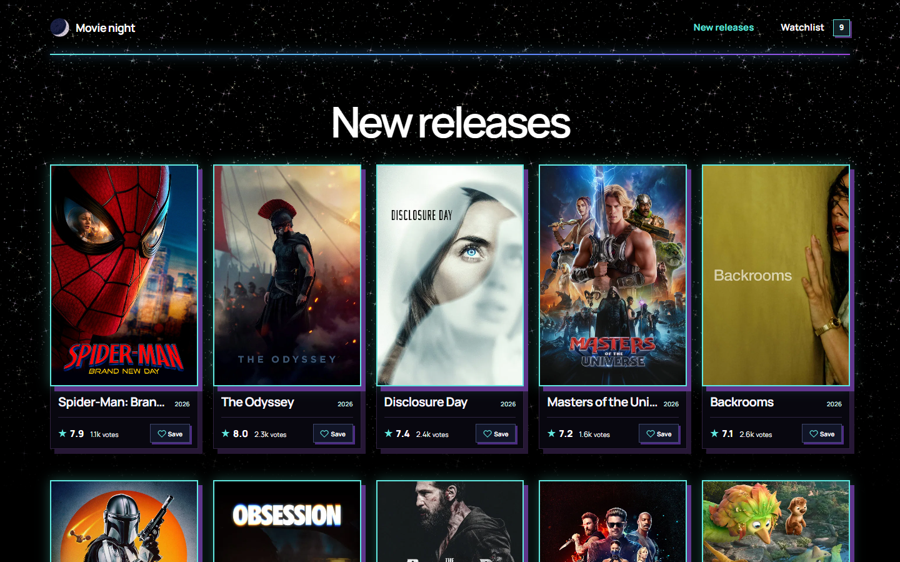
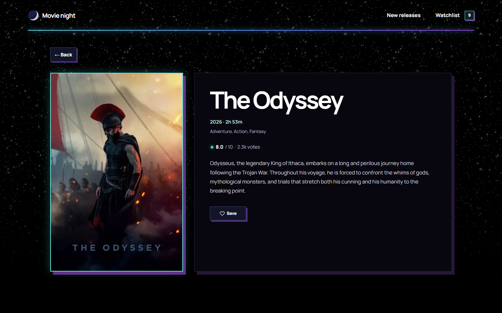
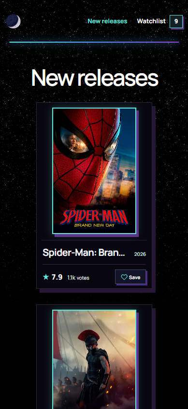

# Movie night

A full-stack movie discovery app built around how I like to find new movies: narrowing recent releases into a manageable shortlist using rating and audience-vote thresholds, then saving interesting ones to a watchlist.

The filtering thresholds are fixed for this MVP. More features may be added in the future.

**Stack:** React, Flask, SQLite, CSS, and the TMDB API.

## Features

- Filtered view of recent movie releases
- Movie details
- Persistent watchlist
- Responsive layouts
- Loading and error states

## Screenshots

**Live demo coming soon.**

### New releases

[](docs/new_releases.png)

### Movie details

[](docs/movie_details.png)

### Mobile view

[](docs/mobile_view.png)

## Local setup

Create the environment files:

```bash
cp flask-backend/.env.example flask-backend/.env
cp react-frontend/.env.example react-frontend/.env
```

Add your [The Movie Database (TMDB)](https://www.themoviedb.org) API read access token to `flask-backend/.env`. The example URLs already match the local development servers.

Install the backend and frontend dependencies, then start each side in a separate terminal:

```bash
pip install -r flask-backend/requirements.txt
npm --prefix react-frontend install
bash start_backend.sh
bash start_frontend.sh
```


## Deployment variables

- Backend: `TMDB_TOKEN` and `FRONTEND_URL`
- Frontend: `VITE_API_URL`, including the `/api` path

Set `FRONTEND_URL` to the deployed frontend origin and `VITE_API_URL` to the deployed Flask URL, for example `https://api.example.com/api`.

Asset credits and licensing notes are in [`/react-frontend/public/ASSETS.md`](/react-frontend/public/ASSETS.md). 